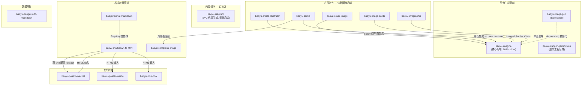

# Baoyu Skills 全景解读

> 本文是对 baoyu-skills 生态中全部 16 个 Agent Skill 的跨 skill 总览，从全景分类、依赖关系、共性设计模式、复杂度光谱、设计哲学到学习路径，为想要学习编写 Agent Skill 的开发者提供一份系统性的参考框架。

---

## 一、Skill 全景图

### 按功能分类总览

| 分类 | Skill | 一句话定位 | 状态 |
|------|-------|-----------|------|
| **图像生成** | `baoyu-imagine` | 统一 10 家 AI 图像 API 的生成后端 | ✅ active |
| | `baoyu-image-gen` | baoyu-imagine 的前身 | ⚠️ deprecated |
| | `baoyu-danger-gemini-web` | 逆向 Gemini Web API 的图像/文本生成 | ✅ active |
| **内容创作** | `baoyu-article-illustrator` | 分析文章结构，批量生成多张插图 | ✅ active |
| | `baoyu-cover-image` | 五维定制系统生成文章封面图 | ✅ active |
| | `baoyu-comic` | 将教育内容转化为多页漫画 PDF | ✅ active |
| | `baoyu-image-cards` | 社交媒体多图卡片系列生成 | ✅ active |
| | `baoyu-infographic` | 21 布局 × 22 风格的专业信息图生成 | ✅ active |
| | `baoyu-diagram` | 暗色主题 SVG 图表生成（9 种类型） | ✅ active |
| **格式转换** | `baoyu-format-markdown` | Markdown 美化与排版优化 | ✅ active |
| | `baoyu-markdown-to-html` | Markdown → 带内联 CSS 的精美 HTML | ✅ active |
| | `baoyu-compress-image` | 图片压缩/格式转换工具 | ✅ active |
| **发布** | `baoyu-post-to-wechat` | 微信公众号文章/图文发布 | ✅ active |
| | `baoyu-post-to-weibo` | 微博帖文/头条文章发布 | ✅ active |
| | `baoyu-post-to-x` | X (Twitter) 多类型内容发布 | ✅ active |
| **数据采集** | `baoyu-danger-x-to-markdown` | X 推文/文章转 Markdown | ✅ active |

### 五大分类的定位逻辑

```
                        ┌──────────────────┐
                        │   数据采集 (1)     │
                        │ danger-x-to-md   │
                        └────────┬─────────┘
                                 │ 内容输入
                                 ▼
┌──────────────────────────────────────────────────────────┐
│                     内容创作 (6)                           │
│  article-illustrator / cover-image / comic / image-cards  │
│  infographic / diagram                                    │
│                                                          │
│     ← 调用 → 图像生成后端 (3): imagine / image-gen / danger-gemini-web │
└────────────────────────┬─────────────────────────────────┘
                         │ 产出内容
                         ▼
              ┌──────────────────────┐
              │    格式转换 (3)        │
              │ format-markdown       │
              │   → markdown-to-html  │
              │ compress-image        │
              └──────────┬───────────┘
                         │ 发布就绪
                         ▼
              ┌──────────────────────┐
              │      发布 (3)         │
              │ post-to-wechat       │
              │ post-to-weibo        │
              │ post-to-x            │
              └──────────────────────┘
```

---

## 二、依赖关系图

### 调用/被调用关系



### 关键关系说明

1. **`baoyu-imagine` 是核心基础设施**：6 个内容创作 skill 依赖其图像生成能力。它的任何 breaking change 都会波及整个生态。

2. **格式转换三件套形成管道**：`format-markdown` → `markdown-to-html` → `post-to-wechat` 是最典型的上下游链路。`markdown-to-html` 的 Step 0 会检测 CJK 内容并建议先用 `format-markdown` 处理；其 Theme fallback 链会读取 `post-to-wechat` 的 EXTEND.md。

3. **`baoyu-diagram` 是唯一自包含的内容创作 skill**：直接输出 SVG 代码，不依赖任何图像生成后端。

4. **`baoyu-compress-image` 是隐性基础设施**：虽然不被显式调用，但 `baoyu-comic` 的角色表压缩逻辑与其能力重叠。

5. **两个 `danger-` 前缀 skill 构成风险标识系列**：`danger-gemini-web`（逆向 Gemini API）和 `danger-x-to-markdown`（逆向 X API）都需要 Consent Gate。

---

## 三、共性设计模式提炼

从全部 16 个 skill 中，可以提炼出以下 10 个共性设计模式：

### 模式 1：EXTEND.md 配置体系

**出现的 skill**：baoyu-imagine、baoyu-comic、baoyu-article-illustrator、baoyu-cover-image、baoyu-image-cards、baoyu-infographic、baoyu-format-markdown、baoyu-markdown-to-html、baoyu-post-to-wechat、baoyu-compress-image（可选）

**模式描述**：通过 YAML frontmatter 格式的 EXTEND.md 文件持久化用户偏好，按三级路径查找——项目级（`.baoyu-skills/<skill>/EXTEND.md`）→ XDG 标准路径 → 用户 Home 目录。首次运行时若未找到配置，触发阻塞式引导完成初始设置。

**设计意图**：解决"一次配置、永久生效"的问题，避免每次运行重复询问 Provider、主题、水印等偏好。三级路径满足了项目级隔离（不同项目不同 Provider）、用户级通用（个人默认偏好）的双重需求。

### 模式 2：User Input Tools 运行时适配

**出现的 skill**：全部 16 个 skill（在 SKILL.md 开头声明）

**模式描述**：不硬编码交互工具名（如 `AskUserQuestion`），而是给出优先级策略——优先使用运行时内置工具 → fallback 到纯文本编号列表 → 支持批量合并提问。

**设计意图**：SKILL.md 可能被不同 Agent 运行时加载（Claude、Cursor、Windsurf、Codex 等），每个运行时的用户交互工具名称不同。这种"声明意图而非硬编码实现"的策略让 skill 具备跨平台可移植性。

### 模式 3：Image Generation Tools 后端选择

**出现的 skill**：baoyu-article-illustrator、baoyu-cover-image、baoyu-comic、baoyu-image-cards、baoyu-infographic

**模式描述**：4 级优先级瀑布选择图像生成后端——当前请求显式指定 → EXTEND.md `preferred_image_backend` → Auto-select（Codex imagegen > 运行时原生工具 > 唯一已安装非原生后端 > 多后端询问）→ 无可用后端通知用户。附带硬约束"⛔ 绝不用 SVG/HTML/Canvas 代替光栅图像生成"。

**设计意图**：内容创作 skill 不关心"谁来画"，只关心"画出来"。通过运行时自省（检查可用 tools/skills 列表），skill 可以在 Codex、Claude、Windsurf 等不同环境中自动适配到最优的图像后端。

### 模式 4：Confirmation Policy 分级设计

**出现的 skill**：baoyu-article-illustrator、baoyu-cover-image、baoyu-comic、baoyu-image-cards、baoyu-infographic、baoyu-post-to-wechat、baoyu-post-to-weibo、baoyu-post-to-x

**模式描述**：确认策略分为三级——⛔ Hard Gate（无论如何不可跳过，如首次 EXTEND.md 设置）、⚠️ Required Gate（默认必须确认但可被 `--quick`/`--yes`/"直接生成" 等关键词跳过）、无 Gate（如 baoyu-diagram、baoyu-compress-image，操作低风险直接执行）。跳过确认后仍要声明假设参数，保证透明度。

**设计意图**：确认步骤的必要性取决于操作的**不可逆程度和试错成本**。调用付费 API 生成图片（高成本）需要确认；生成 SVG 代码（零成本）不需要。在"过度自主"和"过度打扰"之间找到平衡。

### 模式 5：Consent Gate（danger 系列）

**出现的 skill**：baoyu-danger-gemini-web、baoyu-danger-x-to-markdown

**模式描述**：在 skill 执行前强制用户确认免责声明。Consent 文件带版本号（`disclaimerVersion: "1.0"`），当条款更新时递增版本号即可强制重新确认。文件含 ISO 时间戳，具备可审计性。即使已确认，每次调用仍打印警告。

**设计意图**：逆向工程类 skill 存在违反 ToS、随时失效等风险。Consent Gate 是法律保护（明确责任归属），也是用户尊重（充分知情后自主选择）。版本化设计让条款更新后不需要删除旧文件就能触发重新确认。

### 模式 6：Prompt File 可复现性

**出现的 skill**：baoyu-article-illustrator、baoyu-cover-image、baoyu-comic、baoyu-image-cards、baoyu-infographic

**模式描述**：在调用任何图像生成后端之前，必须先将完整 prompt 写入 `prompts/` 下的独立文件（hard requirement）。prompt 文件带 YAML frontmatter 记录参考图、风格、后端等元数据。

**设计意图**：prompt 文件是**可复现性记录**——换后端时不需重新生成 prompt；调试时可直接审查 prompt 内容；失败重试时复用已有 prompt。"先落盘再执行"的模式将"创意决策"与"执行生成"彻底解耦。

### 模式 7：⛔ BLOCKING / ⚠️ REQUIRED 标记体系

**出现的 skill**：baoyu-imagine、baoyu-comic、baoyu-article-illustrator、baoyu-cover-image、baoyu-image-cards、baoyu-infographic、baoyu-post-to-wechat

**模式描述**：用视觉化 emoji 标记（⛔ / ⚠️）+ 大写关键词（BLOCKING / REQUIRED / CRITICAL / NEVER）构成多层级约束体系。⛔ BLOCKING 表示完全阻塞后续流程；⚠️ REQUIRED 表示必须执行但不阻塞前置步骤；CRITICAL/NEVER 表示绝对禁止某行为。

**设计意图**：LLM 倾向于"尽快完成任务"，可能跳过配置步骤。视觉醒目的标记 + 明确的严重级别让 LLM 区分"绝对不能跳过""必须做但有灵活空间""建议但可选"三个层级，本质上是用 Prompt 模拟同步编程中的阻塞语义。

### 模式 8：跨 Skill 协作与配置继承

**出现的 skill**：baoyu-markdown-to-html ↔ baoyu-format-markdown ↔ baoyu-post-to-wechat

**模式描述**：skill 之间通过两种机制协作——(1) **可选前置协作**：`markdown-to-html` 的 Step 0 检测到 CJK 内容后建议先调用 `format-markdown`，但不强制依赖；(2) **跨 skill 配置 fallback**：`markdown-to-html` 的 Theme 解析会读取 `post-to-wechat` 的 EXTEND.md 作为第三优先级来源。

**设计意图**：保持每个 skill 的**独立可用性**，同时在组合使用时产生协同效果。"有则用、无则跳"的 fallback 实现了零耦合的偏好继承，避免用户在多个 skill 中重复配置相同偏好。

### 模式 9：Reference Images 多用途设计

**出现的 skill**：baoyu-article-illustrator、baoyu-cover-image、baoyu-comic、baoyu-image-cards、baoyu-infographic

**模式描述**：参考图支持三种使用模式——`direct`（直接作为视觉参考传给后端 `--ref`）、`style`（提取风格特征写入 prompt 文本）、`palette`（提取 hex 色值注入 prompt）。当后端不支持 `--ref` 时，自动降级为文字描述嵌入 prompt（graceful degradation）。

**设计意图**：不同图像后端对参考图的支持程度不同（Google 支持 multimodal ref，Z.AI 不支持）。三种模式让用户提供的参考图在任何后端下都能发挥作用——即使后端无法"看到"图片，也能通过文字描述传达视觉意图。

### 模式 10：Auto-Selection 信号匹配

**出现的 skill**：baoyu-article-illustrator、baoyu-cover-image、baoyu-image-cards、baoyu-infographic、baoyu-imagine

**模式描述**：通过内容信号（关键词、内容类型、情感倾向）自动推荐最佳参数组合。将推断逻辑外化为**查找表**（Content Signals → Type/Style/Layout），而非让 LLM 自由推理。推荐值作为 AskUserQuestion 的默认选项置顶，用户只需"接受推荐"或"点选替代"。

**设计意图**：大参数空间（如 baoyu-cover-image 的 22,176 种组合、baoyu-infographic 的 462 种组合）对用户是决策负担。信号匹配查找表将 AI 的隐式推理转为确定性的表查找，提高输出的一致性和可预测性；同时保留用户覆盖权，不牺牲灵活性。

---

## 四、复杂度光谱分析

从简到繁排列所有 skill，帮助理解"什么场景需要什么复杂度"：

| 排名 | Skill | 配置项 | Workflow 步骤 | 后端数量 | 核心复杂度来源 | 复杂度评级 |
|------|-------|--------|-------------|---------|--------------|----------|
| 1 | `baoyu-compress-image` | 3 | 1 步 | 0（本地工具链） | 工具降级链 | ⭐ |
| 2 | `baoyu-diagram` | 0（无 EXTEND.md） | 8 步线性 | 0（SVG 代码生成） | Design System 内嵌 | ⭐⭐ |
| 3 | `baoyu-format-markdown` | 3 | 7 步 | 0（脚本处理） | AI+脚本混合架构 | ⭐⭐ |
| 4 | `baoyu-danger-x-to-markdown` | 2 | 3 步 | 0（逆向 API） | Consent Gate + Cookie 管理 | ⭐⭐ |
| 5 | `baoyu-markdown-to-html` | 4 | 3.5 步 | 1（baoyu-md npm 包） | 跨 skill 配置 fallback | ⭐⭐ |
| 6 | `baoyu-post-to-weibo` | 3 | 3 步 | 1（纯 CDP） | 浏览器自动化 + "只填不发" | ⭐⭐⭐ |
| 7 | `baoyu-danger-gemini-web` | 5 | 4 步 | 1（逆向 Gemini） | 分层认证 + Cookie 刷新 | ⭐⭐⭐ |
| 8 | `baoyu-cover-image` | 12（5+1 维） | 6 步 | 多后端自动选择 | 22,176 种参数组合管理 | ⭐⭐⭐⭐ |
| 9 | `baoyu-infographic` | 8 | 7 步 | 多后端自动选择 | 462 种 Layout×Style 组合 | ⭐⭐⭐⭐ |
| 10 | `baoyu-image-cards` | 10 | 5 步 | 多后端自动选择 | Image-1 Anchor Chain 一致性 | ⭐⭐⭐⭐ |
| 11 | `baoyu-article-illustrator` | 10 | 6 步 | 多后端自动选择 | 位置分析 + 批量 prompt 编排 | ⭐⭐⭐⭐ |
| 12 | `baoyu-post-to-wechat` | 15+ | 5 步 | 2（API + Browser CDP） | 双方法架构 + 多账号 + 图片占位 | ⭐⭐⭐⭐ |
| 13 | `baoyu-post-to-x` | 8 | 4 步 × 3 模式 | 3（Codex Plugin/Computer Use/CDP） | 三运行时模式决策树 | ⭐⭐⭐⭐⭐ |
| 14 | `baoyu-imagine` | 20+ | 2 步核心 + 批量 | 10 Provider | 多 Provider 路由 + 批量限流 | ⭐⭐⭐⭐⭐ |
| 15 | `baoyu-comic` | 15+ | 9 步 | 多后端 + 角色表 | 角色一致性链 + 9 步流水线 | ⭐⭐⭐⭐⭐ |
| 16 | `baoyu-image-gen` | (同 imagine) | (同 imagine) | (同 imagine) | deprecated，被 imagine 取代 | — |

### 复杂度分布规律

- **⭐ 级**（1 个）：单一确定性操作，无需 AI 判断，零配置即可用
- **⭐⭐ 级**（4 个）：有 AI 参与但流程线性，或有少量配置项
- **⭐⭐⭐ 级**（2 个）：涉及外部系统交互（浏览器/逆向 API），需要认证管理
- **⭐⭐⭐⭐ 级**（5 个）：大参数空间 + 多步 workflow + 确认门控
- **⭐⭐⭐⭐⭐ 级**（3 个）：多后端/多模式 + 复杂编排 + 长流水线

**核心洞察**：复杂度主要由三个因素驱动——**(1) 参数空间的大小**（维度越多，需要越精细的推荐和确认机制）、**(2) 外部依赖的数量**（后端越多，路由和降级逻辑越复杂）、**(3) 中间产物的链式依赖**（步骤越多，一致性维护越难）。

---

## 五、设计哲学总结

从这套 16 个 skill 中，可以提炼出以下 Agent Skill 设计原则：

### 原则 1：SKILL.md 是写给 LLM 的 SOP，不是写给人的 README

SKILL.md 的目标读者是 LLM Agent，不是人类开发者。因此它使用 ⛔ BLOCKING 标记模拟阻塞语义、用决策表替代自然语言描述、用 NEVER/CRITICAL 等约束词控制行为边界。`baoyu-imagine` 的 Provider Selection 决策树和 `baoyu-comic` 的 Progress Checklist 是这一原则的最佳体现。

### 原则 2：配置持久化是多轮交互 skill 的基石

任何需要用户偏好的 skill 都应设计持久化机制。baoyu-skills 生态的统一方案是 EXTEND.md（YAML frontmatter），配合"首次运行⛔ BLOCKING 引导"实现"一次配置、永久生效"。`baoyu-compress-image` 是唯一将 EXTEND.md 设为纯可选的 skill——因为它的默认值（webp, quality=80）足以满足 80% 场景。

### 原则 3：确认门控的必要性与操作不可逆程度成正比

`baoyu-diagram`（生成 SVG，成本为零）不需要确认；`baoyu-compress-image`（可逆操作，保留原文件）不需要确认；`baoyu-infographic`（调用付费 API）需要硬门控确认；`baoyu-post-to-weibo`（发布到公共平台）需要"只填不发"的人工确认。试错成本决定了门控力度。

### 原则 4：Graceful Degradation 优于 Hard Failure

贯穿整个生态的核心理念：遇到能力缺失时降级而非报错。`baoyu-comic` 的角色表 `--ref` 传递失败时降级为文字描述；`baoyu-compress-image` 的工具链逐级降级（sips → ImageMagick → Sharp）；`baoyu-cover-image` 的参考图在后端不支持 `--ref` 时转为文字描述嵌入 prompt。**永远给自己留一条路径能走通**。

### 原则 5：透明度是信任的基础

`baoyu-imagine` 每次生成前显示 Provider/Model 信息并告诉用户如何切换；所有 Confirmation Policy 在跳过确认后仍需声明假设参数；`baoyu-danger-gemini-web` 即使已获 Consent 也每次打印警告。在涉及付费 API 或不可逆操作时，透明度不是锦上添花而是必需品。

### 原则 6：维度正交 + 推荐矩阵是管理大参数空间的最优策略

`baoyu-cover-image`（Type × Palette × Rendering × Text × Mood × Font = 22,176 种）、`baoyu-infographic`（Layout × Style = 462 种）、`baoyu-image-cards`（Style × Layout × Palette = 384 种）都采用相同策略：维度正交分离 → 兼容性矩阵约束推荐 → Auto-Selection 信号匹配 → Preset 快捷方式降维。N+M 个定义文件产生 N×M 种组合的"乘法扩展性"。

### 原则 7：中间产物是长流程的灵魂

`baoyu-comic` 的 9 步流水线每步都产出独立文件（analysis.md → storyboard.md → prompts/*.md → *.png → .pdf）；`baoyu-article-illustrator` 的 outline.md 和 prompts/ 目录。中间产物让流程可暂停、可审阅、可断点续传、可跨后端迁移，是"可复现性"和"可调试性"的物理载体。

### 原则 8：平台限制应内化为默认行为

`baoyu-post-to-wechat` 默认开启 citation 转换（因为微信不支持外链）；`baoyu-post-to-weibo` 自动在中文标点处截断超长标题（因为微博有 32 字限制）；`baoyu-markdown-to-html` 的 Citation Mode 默认关闭但在微信场景自动启用。**不对抗平台限制，而是将其内化为 skill 的默认行为**，用户无需了解限制即可获得正确结果。

---

## 六、学习路径建议

### 推荐阅读顺序：入门 → 进阶 → 高级

#### 🟢 入门级（理解基本概念）

**第一站：`baoyu-compress-image`**
- 为什么先读它：最简单的 skill（~80 行 SKILL.md，单脚本），展示了"最小可用 skill"的模板
- 学到什么：零摩擦设计、工具降级链、JSON 输出模式、"何时不需要确认流程"的判断标准

**第二站：`baoyu-diagram`**
- 为什么读它：代码生成型 skill 的典范，展示了"把 Design System 写进 SKILL.md"的模式
- 学到什么：SVG 分层渲染、Design System 内嵌、按需加载 reference 文件、无 EXTEND.md 的简约设计

**第三站：`baoyu-format-markdown`**
- 为什么读它：AI + 脚本混合架构的代表，展示了"蓝图→实施"双阶段模式
- 学到什么：核心约束红线设计（"只改格式不改内容"）、正反面约束对照写法、用户控制粒度分级

#### 🟡 进阶级（掌握核心模式）

**第四站：`baoyu-markdown-to-html`**
- 为什么读它：轻量管道 skill 的典范，展示跨 skill 协作与配置继承
- 学到什么：跨 skill 配置 fallback、可选前置协作模式、管道 skill 的"克制"设计哲学

**第五站：`baoyu-cover-image`**
- 为什么读它：五维参数空间 + 确认门控的完整实现
- 学到什么：EXTEND.md 配置体系、Auto-Selection 信号匹配、Confirmation Policy 双模式、Reference Images 双路径处理

**第六站：`baoyu-infographic`**
- 为什么读它：双维度组合系统（Layout × Style = 462 种）+ 硬门控模式
- 学到什么：Keyword Shortcuts 意图识别捷径、推荐组合表的"最佳实践内置"、穷举式负面清单

**第七站：`baoyu-post-to-wechat`**
- 为什么读它：平台发布类 skill 的全功能范本，展示双方法架构
- 学到什么：API vs Browser CDP 双路径、"Never pre-convert" 防御性约束、Multi-Account 渐进式暴露、5 级 Credential Fallback

#### 🔴 高级级（精通复杂编排）

**第八站：`baoyu-imagine`**
- 为什么读它：核心基础设施 skill，10 Provider 的 Strategy Pattern
- 学到什么：5 层配置优先级链、Provider 自动选择策略、批量模式限流、OpenAI-Compatible Dialect 机制、Legacy 兼容与版本迁移

**第九站：`baoyu-comic`**
- 为什么读它：最复杂的流水线 skill（9 步），展示跨步骤一致性管理
- 学到什么：三级角色一致性链（文本锚点→视觉锚点→逐页传递）、Partial Workflow 断点续传、Progress Checklist 认知脚手架、渐进降级策略

**第十站：`baoyu-post-to-x`**
- 为什么读它：三运行时模式决策树，多环境适配的极端案例
- 学到什么：多模式互斥约束、故障恢复分步判断树、"Never click Publish" 安全范式、反自动化检测绕过的"真实信号链"

**第十一站：`baoyu-danger-gemini-web`**
- 为什么读它：逆向工程类 skill 的安全设计哲学
- 学到什么：Consent Gate 版本化设计、分层认证降级策略（Cookie → CDP 复用 → 启动浏览器）、Promise.any 多候选竞争模式、"danger" 命名约定

**最后：`baoyu-image-gen`**
- 为什么最后读：作为 deprecated skill 的案例研究
- 学到什么：Description 前缀标注 `[Deprecated: use X]`、配置自动迁移、环境变量不改名的向后兼容策略——"让迁移成本归零，让发现成本归零"

### 按目标选择学习路径

| 你的目标 | 推荐路径 |
|---------|---------|
| 写第一个 skill | compress-image → diagram → format-markdown |
| 学习多 Provider 路由 | imagine → cover-image |
| 学习复杂 workflow 编排 | comic → article-illustrator |
| 学习跨 skill 协作 | format-markdown → markdown-to-html → post-to-wechat |
| 学习平台发布自动化 | post-to-weibo → post-to-wechat → post-to-x |
| 学习参数空间设计 | cover-image → infographic → image-cards |
| 学习安全与风险控制 | danger-gemini-web → danger-x-to-markdown → post-to-x |

---

> **结语**：baoyu-skills 不只是 16 个独立工具的集合，而是一套经过精心设计的 Agent Skill 生态。从最简的 compress-image（80 行 SKILL.md）到最复杂的 comic（九步流水线 + 角色一致性链），这套 skill 展示了 Agent Skill 设计从"能用"到"好用"的完整光谱。理解这些模式、原则和取舍，比记住任何一个 skill 的具体实现更有价值。
